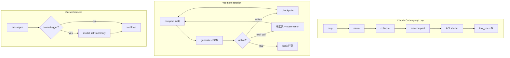

# Agent 内核审计：vec-next vs Claude Code vs Cursor

更新时间：2026-06-17

> **范围**：用户看不见的运行时机制（控制循环、协议、压缩、记忆、写盘、纠偏、上下文注入）。  
> **不覆盖**：三栏 UI、审查 Tab、`AgentEvent` 展示层（那是 L1 的投影）。  
> **联动**：[`agent-handoff.md`](agent-handoff.md)（接续/P0）、[`agent-progress.md`](agent-progress.md)（台账）。

参考：

- Claude Code 本地：`D:\案例\claude-code-claude\claude-code-claude\src\query.ts`、`src/services/compact/*`
- Cursor 公开：[Training Composer for longer horizons](https://cursor.com/blog/self-summarization)（自摘要 / compaction-in-the-loop RL）

---

## 0. 八层内核模型

| 层 | 审计问题 | vec-next 主路径 |
| --- | --- | --- |
| **L1** 控制循环 | 一轮怎么推进、何时停 | `src/agent/core/agent-loop.ts` → `runAgentLoop` |
| **L2** 模型协议 | tool 怎么调、流式与否 | JSON `parseDecision`；`src/agent/model/*` |
| **L3** 上下文整形 | 每轮 API 前 messages 怎么变 | `loop-context-compactor.ts` + `agent-loop.ts` 每 iteration 首部 |
| **L4** 压缩策略 | 谁压、何时压、压完剩什么 | `loop-compaction-layers.ts`、`compact.md` |
| **L5** 记忆层级 | 规则/偏好/会话/任务/跨会话 | `thread-memory-store.ts`、`workspace-memory.ts`、`[COMPACTED_MEMORY]` |
| **L6** 工具与写盘 | 读→改→验 | `agent-loop-tools.ts`、approval 链、auto-apply |
| **L7** 运行时纠偏 | 模型跑偏谁拉回来 | checkpoint、nudge、recovery、lint reloop |
| **L8** 上下文注入 | 索引、layout、选区 | `indexer/*`、`attached-files.ts`、`uiContext` |

---

## 1. 每轮「内部事件循环」对照（核心）

这里的「循环」= **一次模型调用前后的不可见流水线**，不是 UI 的 SSE。

### Claude Code（`queryLoop`，每 turn）

```
snip (可选 boundary yield)
  → microcompact (可选 cache-editing boundary)
  → context collapse 投影 (不 yield，改 messages 视图)
  → autocompact (fork 子 agent / compact 模型)
  → blocking limit 检查
  → API streaming
  → tool_use 块收集 → canUseTool → 执行 → tool_result
  → yieldMissingToolResultBlocks
  → stop hooks / maxTurns → continue 或结束
```

源码锚点：`query.ts` L396–448（压缩链）、L551–824（API+工具）、`services/compact/autoCompact.ts`。

### vec-next（`runAgentLoop`，每 iteration）

```
compactAgentLoopMessages (snip→micro→deterministic→semantic→collapse)
  → emit context.compacted + saveThreadMemory
  → provider.generate (整段，非真流式 tool loop)
  → parseDecision(JSON): reflect | tool_call | final
  → reflect: checkpoint 注入 messages，continue
  → final: 可能被 runtime 拦截（未 prepare）
  → tool: 单工具执行 → observation → 可能 shouldInjectRuntimeReflection
```

源码锚点：`agent-loop.ts` L639–974。

### Cursor（公开行为）

```
harness 与线上一致（shadow backend）
  → 上下文到 token trigger (40k/80k/200k 等)
  → 模型自摘要 (~1k tokens)，摘要替换历史
  → 原生 tool loop；摘要质量由 RL 奖励学习
  → 用户可 /compress 手动触发
```

**结构差异（一句话）**：Claude = **generator + 原生 tool_use**；Cursor = **harness + 模型内嵌自摘要**；vec-next = **for 循环 + JSON 决策 + 外挂压缩 + 审批写盘**。



---

## 2. 分项审计表

图例：**差距** — ✅ 已对齐 · ⚠️ 部分 · ❌ 缺/分叉 · 🔒 架构差（短期不追）  
**建议** — **keep** 保持 · **trim** 瘦身 · **align** 应对标 · **defer** 暂缓

### L1 控制循环

| 子项 | Claude Code | Cursor | vec-next | 差距 | 建议 |
| --- | --- | --- | --- | --- | --- |
| 循环载体 | `async function* queryLoop` | harness 内多轮 | `for (iteration…)` | ⚠️ | align（长期：generator 或原生 tool loop） |
| 单轮多工具 | 一次 API 可多个 `tool_use` | 同 harness | **每 JSON 一次工具** | ❌ | align P1 |
| 显式 reflect 轮 | 无独立 action | 无 | `action=reflect` + checkpoint | ❌ vec 独有 | trim：减频率或改隐式 |
| max 轮次 | `maxTurns` | 未公开 | `maxIterations` 12–16 | ⚠️ | keep |
| 循环后兜底 | stop hooks | 建议新会话 | `edit.recovery` + `final-prepare-nudge` | ❌ vec 独有 | trim P0（日常关 recovery） |
| 状态对象 | `State` 单次解构更新 | harness state | `AgentLoopRunState` | ⚠️ | keep |

### L2 模型协议

| 子项 | Claude Code | Cursor | vec-next | 差距 | 建议 |
| --- | --- | --- | --- | --- | --- |
| 工具调用格式 | API `tool_use` / `tool_result` | 与训练一致 | 自定义 JSON 字符串 | ❌ | align P0（最大协议债） |
| 流式 | 真 streaming + streaming tool exec | 有 | `generate` 后一次性 `model.delta` | ❌ | align P2 |
| JSON 解析失败 | API 层错误处理 | — | **直接 break 整轮** | ❌ | align P1（重试/修复 JSON） |
| 压缩调用 | 独立 `querySource=compact` fork | 模型自写摘要 | `provider.compact` + `compact.md` | ⚠️ | keep（A110 已模块化） |
| Vision | 多模态 messages | 有 | `agentMessagesHaveImages` | ⚠️ | keep |

### L3 上下文整形（API 前）

| 子项 | Claude Code | Cursor | vec-next | 差距 | 建议 |
| --- | --- | --- | --- | --- | --- |
| 压缩触发点 | **每 queryLoop 迭代开头** | token trigger | **每 iteration 开头** | ✅ | keep |
| 压缩顺序 | snip→micro→collapse→auto | RL 学顺序 | snip→micro→auto→collapse | ⚠️ collapse 顺序相反 | align P2（评估是否先 collapse） |
| boundary 消息 | snip/micro **yield** 进 transcript | 未公开 | 仅 `context.compacted` 事件 | ⚠️ | defer |
| tool 结果整形 | `contentReplacement`、外置大结果 | 模型学会丢 | 外置 `.agent-state/tool-results/` + stub（A115） | ✅ | keep |
| Head/Tail 切分 | 复杂 token 估算 + 缓存 | KV 复用强调 | `splitLoopMessagesForCompaction` tail=12 | ⚠️ | keep + 实测调参 |

### L4 压缩策略

| 子项 | Claude Code | Cursor | vec-next | 差距 | 建议 |
| --- | --- | --- | --- | --- | --- |
| Snip | `HISTORY_SNIP` | 模型学丢 stale | `snipLowValueMiddleMessages` | ✅ | keep |
| Micro | `microCompact.ts` / cache editing | 模型学丢 | `microCompactMiddleObservations` | ✅ | keep |
| Auto-compact | `autoCompact.ts` 阈值≈ctx−13k | 自摘要 ~1k | 确定性 + semantic + ratio 阈值 | ⚠️ | keep；无法复制 RL |
| Reactive | `reactiveCompact.ts` | harness 内 | `isContextOverflowError` + `forceCompact` | ✅ | keep |
| Collapse | **读时投影**，跨 turn 持久 | — | soft tool-collapse（A118）+ emergency collapse | ⚠️ | keep |
| 钉住 approval_id | compact prompt 强制 | RL 奖励 | `loop-pinned-facts.ts` | ✅ | keep |
| 钉住 file.read 片段 | file state cache | — | `loop-files-read-pin.ts` | ⚠️ | keep |
| 钉住 prepareHint | — | — | `loop-prepare-hint-pin.ts` | vec 独有 | trim P1（UI 路径专用） |
| Compact prompt | `services/compact/prompt.ts` | 权重内 | `prompts/compact.md` A110 | ✅ | keep |

Claude 阈值参考：`AUTOCOMPACT_BUFFER_TOKENS=13000`（`autoCompact.ts`）。  
vec-next：`compressionThresholdRatio` + `MIDDLE_MSG_TRIGGER=8` + `MIDDLE_TOKEN_TRIGGER=4000`（`loop-compaction-config.ts`）。

### L5 记忆层级

| 优先级 | Claude Code | Cursor | vec-next | 差距 | 建议 |
| --- | --- | --- | --- | --- | --- |
| 项目规则 | `CLAUDE.md` | rules | `AGENTS.md` | ⚠️ | keep |
| 用户偏好 | 设置 + MEMORY.md | 设置 | `.agent-state/MEMORY.md` A110 | ✅ | keep |
| 会话 transcript | 完整 REPL | chat | Trace events | ⚠️ | keep |
| 任务滚动 | compact boundary | 自摘要链 | `[COMPACTED_MEMORY]` + `thread-memory.json` | ⚠️ | keep |
| Thread 续聊 | session memory compact | session | `getThreadMemory` 注入 | ✅ | keep |
| 大 tool 外置 | `toolResultStorage` / tombstone | — | `.agent-state/tool-results/` A115 | ✅ | keep |

### L6 工具与写盘

| 子项 | Claude Code | Cursor | vec-next | 差距 | 建议 |
| --- | --- | --- | --- | --- | --- |
| 改文件 | `Write`/`Edit` 直接 | 编辑器 apply | `*.prepare` → approval → execute | 🔒 | **产品决策**：默认 direct write（P0） |
| prepare 门禁 | 无 | 无 | `assertPrepareGate`（仅 strict） | ✅ 已关默认 | keep strict only |
| 权限 | `canUseTool` + permission mode | 终端授权 | 风险级 + auto-apply | ⚠️ | keep |
| Shell | Bash in-loop + `tool_result` | terminal harness | prepare→approve→execute→续跑（A141 dev-run playbook + recovery） | ⚠️ | **align** P0：`trial:shell-recovery`；长期评估 Bash 回灌 |
| Git | 直接 / 策略 | IDE git | `git.mutation.prepare` | ⚠️ | keep |

### L7 运行时纠偏（vec-next 最重）

| 机制 | 文件 | Claude/Cursor | 建议 |
| --- | --- | --- | --- |
| Runtime checkpoint | `agent-loop-state.ts` `buildRuntimeCheckpoint` | 无等价物 | **trim**：仅错误/消歧时注入 |
| `shouldInjectRuntimeReflection` | `agent-loop.ts` L412 | 无 | **trim**：减触发条件 |
| UI prepare nudge | `ui-prepare-nudge.ts` | 索引代替 | **trim** P1 |
| `edit.recovery` | `edit-recovery.ts` | 无 | **trim** P0：默认关，仅 trial |
| `final-prepare-nudge` | `final-prepare-nudge.ts` | 无 | **trim** P1 |
| post-execute lint reloop | `post-execute-verify.ts` + panel | Cursor 有 verify | **keep**（对齐 Cursor 自动修） |
| 拦截 premature `final` | `agent-loop.ts` L815 | 无 | **trim** 若 direct write |

### L8 上下文注入

| 子项 | Claude Code | Cursor | vec-next | 差距 | 建议 |
| --- | --- | --- | --- | --- | --- |
| 语义搜索 | Grep/Glob/MCP | codebase index | `project.index` + `file.search` | ⚠️ | align P2 |
| UI 定位 | — | DOM/LSP | trace/locate/jsx/symbol | ⚠️ vec 强在 Web | keep |
| Open tabs | @file | **自动 open files** | @path + 审查选区 A108 | ❌ | align P2（Electron） |
| layout 态 | — | preview | `uiContext.layout` | vec 独有 | keep |
| 浏览器 | MCP Chrome | Browser tool | CDP-lite A025 | ⚠️ | defer 完整 CDP |

---

## 3. 已关闭 vs 待办（相对上次 handoff）

### 已关闭（A109–A110）

- 五层压缩 + `validate:compaction-layers`
- `prompts/compact.md`、`prompts/loop-system.md`、`MEMORY.md`
- prepare 硬门禁默认关（产品决策）

### 待办 backlog（建议 ID）

| ID | 层 | 标题 | 优先级 | 说明 |
| --- | --- | --- | --- | --- |
| **A111** | L1/L2 | 内核审计文档 | done | 本文档 |
| **A112** | L6 | 直接写盘工具路径 | done | `file.replace` / `file.mutation` / `patch.apply`；`validate:direct-apply` |
| **A113** | L7 | 纠偏瘦身 | done | 默认关 recovery/final-nudge；checkpoint 仅失败时加重 |
| **A114** | L2 | 原生 tool loop | done | 默认 OpenAI `tools`/`tool_calls`；`AGENT_LOOP_JSON_PROTOCOL=1` 回退；`validate:native-tool-loop` |
| **A115** | L3 | 大 tool 结果外置 | done | `.agent-state/tool-results/` + stub；`AGENT_TOOL_RESULT_EXTERNALIZE=0` 回退截断；`validate:tool-result-externalize` |
| **A116** | L4 | collapse 投影调研 | done | 结论：**defer** 全量移植；已有 A118 soft collapse |
| **A117** | L8 | open tabs 注入 | done | `@` 附着 + 审查选区 → `openEditorPaths` / `activeEditorPath`；`validate:open-tabs-inject` |
| **A118** | L4 | soft tool-collapse | done | middle 过旧 tool 观测折叠；`validate:soft-tool-collapse` |
| **A119** | L3 | 压缩层离线基准 | done | `validate:compaction-benchmark` → `.agent-state/compare/compaction-benchmark.json` |
| **A120** | L4 | micro 原生 tool 观测 | done | `microCompactMiddleObservations` 支持 `role:tool` |
| **A121** | L2 | OpenAI tool 名编码 | done | `file.read` → `file_read`；历史 `tool_calls` 序列化 |

---

## 4. 推荐实施顺序

1. ~~**P0**~~ **A112/A113 已完成**（直接写盘 + 纠偏瘦身）。  
2. ~~**P1**~~ **A114 已完成**（原生 tool loop，JSON 协议 env 回退）。  
3. ~~**P2 起步**~~ **A115 已完成**（大 tool 结果外置）。  
4. ~~**P2 续**~~ **A116–A119 已完成**；实机长任务：`npm run trial:long-thread`。  
5. **不追**：Claude 全量 CONTEXT_COLLAPSE 双轨投影；Cursor RL 自摘要。

---

## 5. 回归命令（内核专用）

```bash
npm run validate:agent
npm run validate:compaction
npm run validate:compaction-layers
npm run validate:direct-apply
npm run validate:native-tool-loop
npm run validate:tool-result-externalize
npm run validate:open-tabs-inject
npm run validate:soft-tool-collapse
npm run validate:compaction-benchmark
npm run validate:agent-prompts
npm run validate:thread-memory
npm run trial:long-thread          # 长线程压测
npm run trial:semantic-compare     # 确定性 vs semantic
```

---

## 6. 审计维护约定

- 每完成一项内核改动：更新本文 **§2 差距列** 与 **§3 backlog 状态**。
- 产品待办与收工：[`agent-handoff.md`](agent-handoff.md)；台账：[`agent-progress.md`](agent-progress.md)。
- A116 collapse：**defer** 全量移植；保留 A118 soft collapse。
